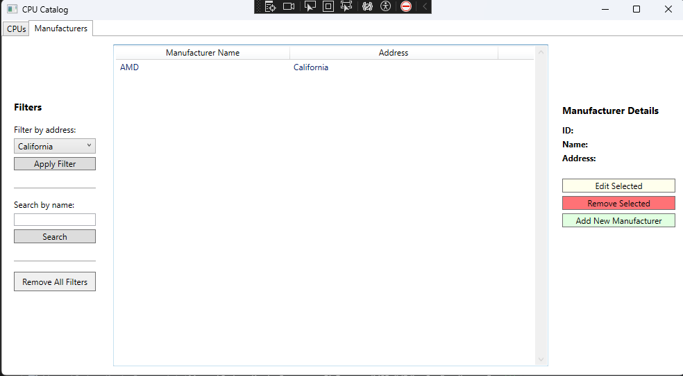
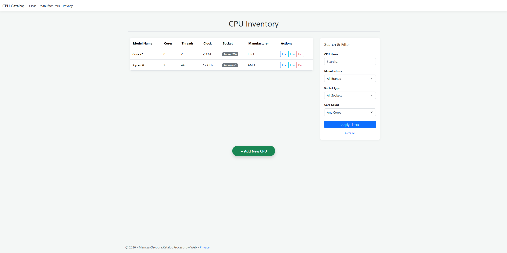

# Processor Catalog (Katalog Procesorów)

### 🇵🇱 Opis Projektu
Projekt demonstrujący praktyczne zastosowanie wzorców projektowych i zasad SOLID. Implementacja wymiennej warstwy dostępu do danych (**Repository Pattern**) obsługującej **MySQL (Entity Framework)**, pliki tekstowe oraz obiekty Mock. System oferuje spójną logikę biznesową zarówno dla aplikacji desktopowej, jak i webowej.

### 🇬🇧 Project Description
A project demonstrating the practical application of design patterns and SOLID principles. It features an interchangeable Data Access Layer (**Repository Pattern**) supporting **MySQL (Entity Framework)**, flat text files, and Mock objects. The system provides unified business logic shared across both desktop and web applications.

---

## Screenshots / Interfejs

| Desktop UI (WPF) | Web Interface (ASP.NET Core) |
| :---: | :---: |
|  |  |

---

## Architecture / Architektura

The project is divided into several layers to ensure high maintainability and low coupling:

*   **`ManczakSzybura.KatalogProcesorow.CORE`**: Contains domain models (CPU, Manufacturer) and common Enums.
*   **`ManczakSzybura.KatalogProcesorow.Interfaces`**: Defines the contracts for Data Access Objects (DAO).
*   **`ManczakSzybura.KatalogProcesorow.BL`**: Centralized Business Logic layer that enforces rules.
*   **`ManczakSzybura.KatalogProcesorow.DAO`**: Multiple implementations of the data layer:
    *   **EF / MySQL**: Persistent storage using Entity Framework Core.
    *   **File DAO**: Storage using text/flat files.
    *   **Mock DAO**: Memory-only storage for testing.
*   **Presentation Layers**:
    *   **WPF App**: A classic Windows desktop application using the MVVM pattern.
    *   **ASP.NET Core MVC**: A modern web interface with responsive design.

---

## Key Features / Kluczowe Funkcjonalności

1.  **Unified Business Logic**: Rules are written once in the `BL` layer and shared between the Web and Desktop versions.
2.  **Interchangeable DAL**: Switch between MySQL, Text Files, or Mock data simply by changing the `DAOLibraryName` in the configuration file (`App.config` or `appsettings.json`).
3.  **Advanced Filtering**: Filter CPUs by Socket Type, Number of Cores, or Manufacturer.
4.  **Relational Integrity**: The system prevents deleting manufacturers that are currently linked to existing CPUs, ensuring data consistency.
5.  **Search**: Real-time search functionality for both processors and manufacturers.

---

## Technologies / Technologie

*   **Language:** C# (.NET)
*   **Desktop:** WPF (Windows Presentation Foundation)
*   **Web:** ASP.NET Core MVC, Bootstrap
*   **ORM:** Entity Framework Core
*   **Database:** MySQL
*   **Patterns:** Repository Pattern, Singleton, Dependency Injection, MVVM, SOLID

---

## Configuration / Konfiguracja

To switch the data source, update the configuration file in the UI or Web project:

```xml
<!-- App.config example -->
<add key="DAOLibraryName" value="ManczakSzybura.KatalogProcesorow.DAO.EF" />
<!-- Options: .EF, .File, .Mock -->